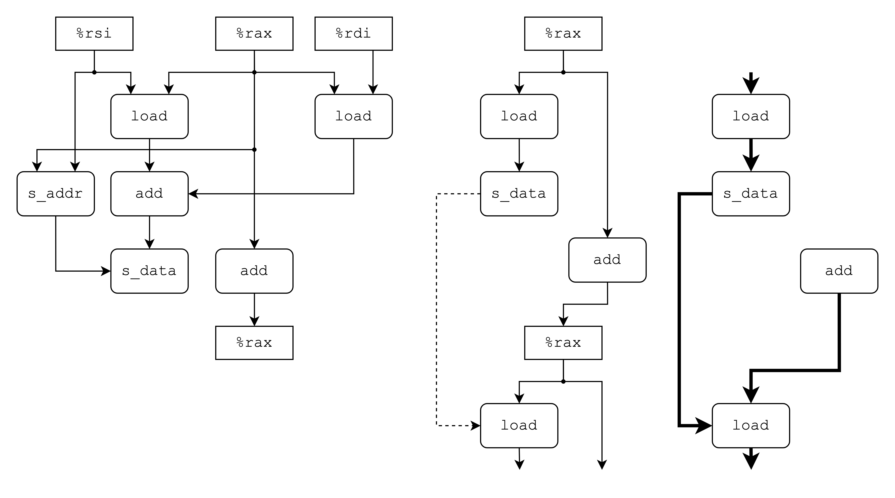
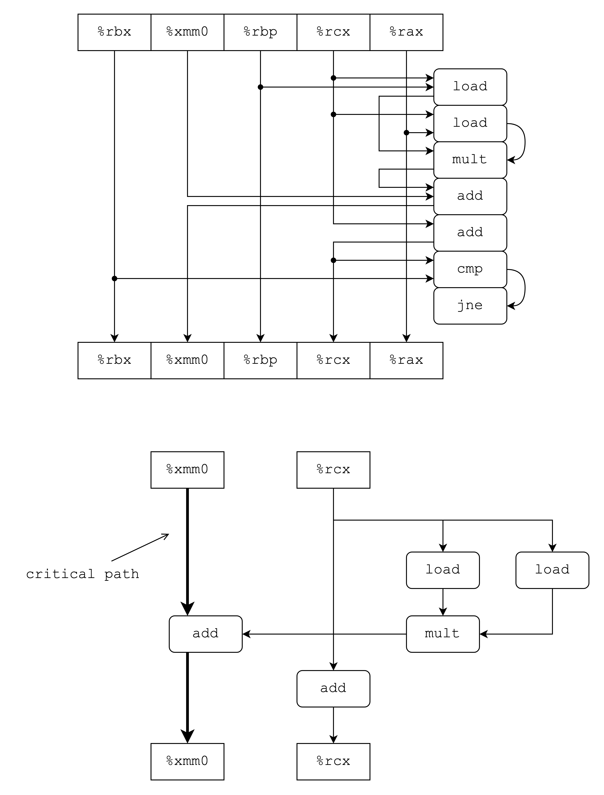

# 5.1

如果存在 memory alias ，则`*yp = *xp - *yp`会导致指针指向的值变成0，最后导致`*xp`和`*yp`都变成0。


# 5.2

1. $n \le 2$ 时 Version 1 最快
2. $2 \le n \le 7$ 时 Version 2 最快
3. $n \ge 8$ 是 Version 3 最快


# 5.3

| Code | `min` | `max` | `incr` | `square` |
| -- | -- | -- | -- | -- | -- |
| A | 1 | 91 | 90 | 90 |
| B | 91 | 1 | 90 | 90 |
| C | 1 | 1 | 90 | 90 |


# 5.4

A. `-O2`优化版本的代码中`%xmm0`用于存储累积计算结果；而`-O1`优化版本则先用于从内存中读取存储上一轮迭代计算的累积，再存储本轮迭代计算结果。
B. 不会。
C. 因为优化版本仍然会在每一轮迭代最后将累积结果更新回内存，即使出现指向同一个内存的指针，在每一轮迭代后这个位置的值仍会被更新，这样就避免了 memory aliasing 的问题。


# 5.5

A. 乘法 $2n$ 次，加法 $n$ 次。
B. 两条乘法指令需要5个时钟周期，而下一次迭代需要的`xpwr`必须要等待本次迭代计算完成后进行；加法指令只需要3个时钟周期。由于数据转发机制，乘法指令`result += a[i] * xpwr`可以把结果转发给加法执行，因此只需要5个周期。


# 5.6

A. 乘法 $n$ 次，加法 $n$ 次。
B. 由于指令`result = a[i] + x*result`内部存在依赖，因此执行完乘法指令后才能开始执行加法指令，因此需要8个时钟周期。
C. 尽管减少了一次乘法操作，但是由于数据依赖度过高，不能很好利用数据并行性，因此相对 CPE 更高。


# 5.7

直接仿照教材上提供的模版即可。

```c
void unroll5(vec_ptr v, data_t *dest)
{
	long i;
	long length = vec_length(v);
	long limit = length - 4;
	data_t *data = get_vec_start(v);
	data_t acc = IDENT;

	/* Combine 2 elements at a time */
	for (int i = 0; i < limit; i += 2) {
		acc = acc OP data[i]     OP data[i + 1];
		acc = acc OP data[i + 2] OP data[i + 3];
		acc = acc OP data[i + 4];
	}

	/* Finish any remaining elements */
	for (; i < length; i++) {
		acc = acc OP data[i];
	}
}
```


# 5.8

通过绘制数据流图进行分析可以发现：
A1：关键路径上存在3次乘法运算
A2：关键路径上存在2次乘法运算
A3：关键路径上存在1次乘法运算
A4：关键路径上存在1次乘法运算
A5：关键路径上存在2次乘法运算

$$
CPE=\frac{5P}{3}
$$

其中 $P$ 表示关键路径上乘法指令的数量， $5$ 表示单个乘法指令的 latency bound ，$3$ 表示总乘法指令个数。

对应计算得，A1的 CPE 为 5，A2和A5的 CPE 为 3.33，A3和A4的 CPE 为 1.67。


# 5.9

```c
void merge(long src1[], long src2[], long dest[], long n) {
	long i1 = 0;
	long i2 = 0;
	long id = 0;
	while (i1 < n && i2 < n)
		dest[id++] = src1[i1] < src2[i2] ? src1[i1++] : src2[i2++];
	while (i1 < n)
		dest[id++] = src1[i1++];
	while (i2 < n)
		dest[id++] = src2[i2++];
}
```


# 5.10

A. 执行结束后，对于 $0 \le i < 999$ 有 `a[i] = i + 1`。
B. 执行结束后，对于 $0 \le i \le 999$ 有 `a[i] = 0`。
C. part B的程序在实际执行时存在写/读依赖，在第`i`轮迭代执行结束后，`a[i]`被修改为`0`，而在第`i + 1`轮迭代中需要读`a[i]`，因此存在迭代上下文之间的依赖，使得开销增大。
D. 和 part A 相同，因为不存在上下文迭代之间的依赖关系。

# 5.11



上图分别展示了循环内部的数据流图、抽象数据流图和关键路径图。可以看出，循环体之间存在写/读依赖，在上一次迭代修改`p[i-1]`后执行语句`p[i] = p[i-1] + a[i]`导致需要进行等待。

# 5.12

```c
void psum1(float a[], float p[], long n)
{
	long i;
	float last_acc = a[0], acc;
	p[0] = acc;
	for (int i = 1; i < n; i++) {
		acc = last_acc + a[i];
		p[i] = acc;
		last_acc = acc;
	}
}
```

其中`last_acc`存储`p[i-1]`，`acc`存储`p[i]`的值。这样修改就可以避免内存的写读依赖问题。这个答案参考了课后练习的答案，最初只设置了`acc`一个变量，但这样仍然会存在上下文的耦合，因此必须用两个变量将内存的读写进行彻底的结耦。


# 5.13

A. 参考 E13.drawio.png

这里关键路径分析结果为加法运算，即需要等上一轮迭代的`%xmm0`值确定后才能进行这一轮迭代的运算，因此关键路径确定为上图所示的路径。

B. 由于关键路径为 `double` 加法，查表可得 CPE 的下界为 3.0 。

C. 类似地，可以得到 CPE 下界为 1.0 。

D. 虽然乘法指令需要5个时钟周期才能完成，但是乘法指令不在关键路径上，而加法指令在关键路径上，可以通过优化方法将 CPE 不断降低到理论下界 3.0。

>注意这个题目问的是**CPE的下界**，这里涉及到的是极限的理论分析而不是单纯的值，因此只需要考虑关键路径，而不需要考虑`add`指令的另一个输入，也就是`mult`指令执行所需要的时钟周期。
>
>重新复习一下教材发现，Figure 5.12 的说明提到了 latency 和 issue time 两个概念的区别：latency 指的是实际执行的周期，而 issue time 指的是两条独立的指令之间的最小时钟周期。这里的`mult`运算都是相互独立的，不需要等待计算结束才能执行下一条。而且由于流水线，不需要等待`mult`完全执行结束才能执行`add`指令。因此这里只需要考虑 critical path 上指令的 CPE 。


# 5.14

```c
/* Inner product.  Accumulate in temporary */
void inner4(vec_ptr u, vec_ptr v, data_t *dest) {
	long i;
	long length = vec_length(u);
	long limit = length - 6;
	data_t *udata = get_vec_start(u);
	data_t *vdata = get_vec_start(v);
	data_t sum = (data_t) 0;
	
	for (i = 0; i < limit; i+=6) {
		sum = sum + udata[i] * vdata[i]
				  + udata[i+1] * vdata[i+1]
				  + udata[i+2] * vdata[i+2]
				  + udata[i+3] * vdata[i+3]
				  + udata[i+4] * vdata[i+4]
				  + udata[i+5] * vdata[i+5];
	}
	for (; i < length; i++)
		sum = sum + udata[i] * vdata[i];
	*dest = sum;
}
```

A. 因为加法运算的 CPE = 1.0 ，而关键路径上有 6 条加法指令，平均下来 CPE 的下界就是加法指令的 CPE ，也就是 1.0 ，因此结果不可能小于 1.00。

B. 参考教材 Figure 5.17 ，可以发现 loop unrolling 对于加法指令来说影响甚微，因为 $k \times 1$ 循环展开本身无法进一步利用并行度，因此下界必然是 latency bound。


# 5.15

```c
/* Inner product.  Accumulate in temporary */
void inner4(vec_ptr u, vec_ptr v, data_t *dest) {
	long i;
	long length = vec_length(u);
	long limit = length - 6;
	data_t *udata = get_vec_start(u);
	data_t *vdata = get_vec_start(v);
	data_t sum1 = (data_t) 0;
	data_t sum2 = (data_t) 0;
	data_t sum3 = (data_t) 0;
	data_t sum4 = (data_t) 0;
	data_t sum5 = (data_t) 0;
	data_t sum6 = (data_t) 0;
	
	for (i = 0; i < limit; i+=6) {
		sum1 = sum1 + udata[i] * vdata[i];
		sum2 = sum2 + udata[i+1] * vdata[i+1];
		sum3 = sum3 + udata[i+2] * vdata[i+2];
		sum4 = sum4 + udata[i+3] * vdata[i+3];
		sum5 = sum5 + udata[i+4] * vdata[i+4];
		sum6 = sum6 + udata[i+5] * vdata[i+5];
	}
	for (; i < length; i++)
		sum1 = sum1 + udata[i] * vdata[i];
	*dest = sum1 + sum2 + sum3 + sum4 + sum5 + sum6;
}
```

Integer 和 floating-point 的 CPE 值是短板效应决定的。和教材提供的 case 中研究单一的运算不同的是，练习 5.15 的循环内部涉及加法和乘法两种运算，而 integer 的乘法和 floating-point 的加法的 CPE 的极限都是1.0，因此这里逼近的值也是1.0。同时，根据[[Optimization#9.1]]的不等式，这里的 $k=6$ 不能完全逼近理论极限，因此 integer 类型的 CPE = 1.06。

# 5.16

```c
/* Inner product.  Accumulate in temporary */
void inner4(vec_ptr u, vec_ptr v, data_t *dest) {
	long i;
	long length = vec_length(u);
	long limit = length - 6;
	data_t *udata = get_vec_start(u);
	data_t *vdata = get_vec_start(v);
	data_t sum = (data_t) 0;
	
	for (i = 0; i < limit; i+=6) {
		sum = sum + 
			(
				udata[i] * vdata[i] +
				udata[i+1] * vdata[i+1] + 
				udata[i+2] * vdata[i+2] + 
				udata[i+3] * vdata[i+3] + 
				udata[i+4] * vdata[i+4] + 
				udata[i+5] * vdata[i+5]
			);
	}
	for (; i < length; i++)
		sum1 = sum1 + udata[i] * vdata[i];
	*dest = sum1 + sum2 + sum3 + sum4 + sum5 + sum6;
}
```


# 5.17

```c
/* Origial effective implementation of memset */
void *effective_memset_original(void *s, int c, size_t n)
{
	size_t cnt = 0;
	unsigned char *schar = s;
	unsigned long c2 = c | (c << 8);
	unsigned long c4 = c2 | (c2 << 16);
	unsigned long c8 = c4 | (c4 << 32)
	while (cnt < n - 8) {
		*schar = c8;
		schar += 8;
		cnt += 8;
	}
	while (cnt < n) {
		*schar++ = (unsigned char) c;
		cnt++;
	}
	return s;
}
```

使用位运算将`c8`变成字节`c`的连续8个拷贝，然后参考 $k\times 1$ 循环展开的思想，进行连续的内存块赋值。最后将剩余8字节不到的连续内存用basic方法覆盖。

这原本是一个比较好的方案，但是 guideline 中提示由于不同机器上`unsigned long`大小可能不同，因此不能用这样的方案实现。根据提示我们修改成：

```c
void* effective_memset(void *s, unsigned long cs, size_t n) { 
	/* 按照 K 进行对齐 */ 
	size_t K = sizeof(unsigned long); 
	size_t cnt = 0; 
	unsigned char *schar = s; 
	while (cnt < n) { 
		if ((size_t)schar % K == 0) { 
			break; 
		} 
		*schar++ = (unsigned char)cs; 
		cnt++; 
	} 
	
	/* 一次迭代设置 K 字节连续内存 */ 
	unsigned long *slong = (unsigned long *)schar; 
	size_t rest = n - cnt; 
	size_t loop = rest / K; 
	size_t tail = rest % K; 
	for (size_t i = 0; i < loop; i++) { 
		*slong++ = cs; 
	} 
	
	/* 连接尾部 */ 
	schar = (unsigned char *) slong; 
	for (size_t i = 0; i < tail; i++) { 
		*schar++ = (unsigned char)cs; 
	} 
	
	return s;
}
```

# 5.18

1. 可以将直接计算的方法改写成 $6 \times 3a$ 循环展开的方法，可以多次尝试其他的展开方法直到逼近理论极限。 

```c
double poly_6x3a(double a[], double x, long degree) {
	long i;
	double result1 = a[0];
	double result2 = 0;
	double result3 = 0;
	
	double xpwr1 = x;
	double xpwr2 = x * x * x;
	double xpwr3 = x * x * x * x * x;
	double step = x * x * x * x * x * x;
	
	for (i = 1; i <= degree - 6; i+=6) {
		result1 += (a[i] * xpwr1) + (a[i+1] * xpwr1 * x);
		result2 += (a[i+2] * xpwr2) + (a[i+3] * xpwr2 * x);
		result3 += (a[i+4] * xpwr3) + (a[i+5] * xpwr3 * x);

		xpwr1 *= step;
		xpwr2 *= step;
		xpwr3 *= step;
	}

	for (; i <= degree; i++) {
		result1 += a[i] * xpwr1;
		xpwr *= x;
	}
	
	return result1 + result2 + result3;
}
```

2. Horner's method 必须从内往外进行迭代，无法通过多个累积因子进行并行计算，目前只考虑 $k \times 1$ 的方法进行展开。

```c
/* Horner's method + Loop unrolling */
/* Suppose k = 2 */
double polyh(double a[], double x, long degree)
{
	long i;
	double result = a[degree];
	long limit = (degree + 1) % K;
	long step = (degree + 1) / K;

	for (i = degree - 1; i >= 1; i+=2)
		result = a[i-1] + x*a[i] + x*x*result);

	for (; i >= 0; i--)
		result = a[i] + x*result;
	
	return result;
}
```

# 5.19

按照题目描述的使用 $4 \times 1a$ 展开。

```c
void psum_4x1a(float a[], float p[], long n)
{
	long i;
	float last_acc = a[0], acc;
	float acc1, acc2, acc3, acc4;
	p[0] = acc;
	
	for (int i = 1; i < n - 4; i+=4) {
		acc1 = last_acc + a[i];
		acc2 = last_acc1 + a[i+1];
		acc3 = last_acc2 + a[i+2];
		acc4 = last_acc3 + a[i+3];

		p[i] = acc1;
		p[i+1] = acc2;
		p[i+2] = acc3;
		p[i+3] = acc4;

		last_acc = last_acc + (a[i] + a[i+1] + a[i+2] + a[i+3]);
	}

	for (; i < n; i++) {
		last_acc += a[i];
		p[i] = last_acc;
	}
}
```
